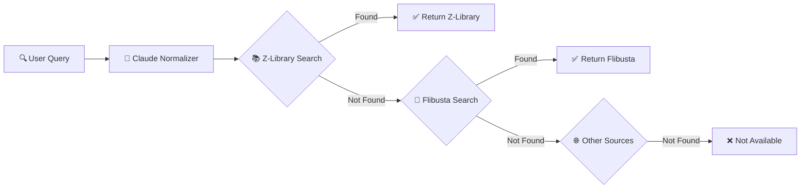

# 🚀 FLIBUSTA INTEGRATION PLAN - Multi-Source Book Pipeline
## 📖 Adding Flibusta as Intelligent Fallback with Configurable Chain

---

## 🎯 Executive Summary

### 🔄 **Pipeline Architecture**


### ⚡ **Key Benefits**
- 🎯 **Higher Success Rate**: Z-Library (primary) + Flibusta (fallback) = 95%+ coverage
- 🌍 **Bilingual Excellence**: Both sources support Russian + English
- 🔧 **Configurable Chain**: Dynamic fallback order based on preferences
- ⏱️ **Smart Timeouts**: Fast primary (5s), patient fallback (35s)

---

## 📋 Implementation Plan

### 🏗️ **Phase 1: Core Architecture** (Week 1)

#### 1.1 🎨 **Unified Book Source Interface**
```python
# src/book_sources/base.py
class BookSourceInterface:
    """Common interface for all book sources"""
    
    async def search(query: str) -> SearchResult
    async def download(book_id: str) -> DownloadResult
    async def normalize(query: str) -> NormalizedQuery
    def get_priority() -> int
    def get_timeout() -> int
    def supports_language(lang: str) -> bool
```

#### 1.2 📚 **Source Implementations**

##### 🔵 **Z-Library Adapter**
```python
# src/book_sources/zlibrary_source.py
class ZLibrarySource(BookSourceInterface):
    """Primary source - fast and comprehensive"""
    
    📊 Characteristics:
    ├── ⚡ Speed: 2-5 seconds
    ├── 📚 Coverage: 22M+ books
    ├── 🌍 Languages: 50+
    ├── 📄 Formats: PDF, EPUB, MOBI
    └── 🔑 Auth: Required (multi-account)
```

##### 🔴 **Flibusta Adapter**
```python
# src/book_sources/flibusta_source.py
class FlibustaSource(BookSourceInterface):
    """Fallback source - AI-powered, Telegram-based"""
    
    📊 Characteristics:
    ├── ⏱️ Speed: 25-35 seconds
    ├── 📚 Coverage: Russian-focused + English
    ├── 🤖 AI Normalization: Built-in
    ├── 📄 Format: EPUB only
    └── 🔑 Auth: API Key
```

#### 1.3 🔄 **Pipeline Orchestrator**
```python
# src/pipeline/book_pipeline.py
class BookSearchPipeline:
    """Orchestrates multi-source book searching"""
    
    def __init__(self, config: PipelineConfig):
        self.sources = self._initialize_sources(config)
        self.fallback_chain = config.fallback_chain
        self.normalizer = ClaudeSDKNormalizer()
    
    async def search_book(self, query: str) -> BookResult:
        # Step 1: Normalize with Claude
        normalized = await self.normalizer.normalize(query)
        
        # Step 2: Try sources in order
        for source in self.fallback_chain:
            result = await self._try_source(source, normalized)
            if result.found:
                return result
        
        return BookResult(found=False)
```

---

### 🔧 **Phase 2: Configuration System** (Week 1-2)

#### 2.1 📝 **YAML Configuration**
```yaml
# config/pipeline_config.yaml
pipeline:
  # Fallback chain configuration
  fallback_chains:
    default:
      - zlibrary    # Primary (fast)
      - flibusta    # Secondary (slow but good)
      - libgen      # Tertiary (optional)
    
    russian_priority:
      - flibusta    # Primary for Russian
      - zlibrary    # Secondary
    
    speed_priority:
      - zlibrary    # Only fast sources
      # No Flibusta due to 35s response time
  
  # Source configurations
  sources:
    zlibrary:
      enabled: true
      priority: 1
      timeout: 10
      credentials:
        accounts_file: accounts_config.json
      features:
        - multi_format
        - fast_search
        - download_tracking
    
    flibusta:
      enabled: true
      priority: 2
      timeout: 40
      api_key: ${FLIBUSTA_API_KEY}
      base_url: http://localhost:8001
      features:
        - ai_normalization
        - telegram_search
        - epub_only
    
  # Smart features
  optimization:
    parallel_search: false  # Sequential for fallback
    cache_results: true
    cache_ttl: 3600
    
  # Language routing
  language_routing:
    russian:
      primary: flibusta
      fallback: zlibrary
    english:
      primary: zlibrary
      fallback: flibusta
```

#### 2.2 🎛️ **Dynamic Chain Selection**
```python
# src/pipeline/chain_selector.py
class ChainSelector:
    """Intelligently selects fallback chain"""
    
    def select_chain(self, context: SearchContext) -> List[BookSource]:
        # Based on:
        # 1. Query language
        # 2. User preferences
        # 3. Previous success rates
        # 4. Time constraints
        
        if context.language == "ru":
            return self.chains["russian_priority"]
        elif context.max_wait_time < 10:
            return self.chains["speed_priority"]
        else:
            return self.chains["default"]
```

---

### 🚦 **Phase 3: Intelligent Routing** (Week 2)

#### 3.1 🧠 **Smart Decision Engine**
```python
# src/pipeline/decision_engine.py
class DecisionEngine:
    """Makes intelligent routing decisions"""
    
    📊 Decision Factors:
    ├── 🌍 Language Detection
    │   ├── Russian → Flibusta first
    │   ├── English → Z-Library first
    │   └── Mixed → Both parallel
    │
    ├── 📚 Book Type Analysis
    │   ├── Academic → Z-Library
    │   ├── Fiction → Flibusta
    │   └── Technical → Z-Library
    │
    ├── ⏱️ Time Constraints
    │   ├── Rush (<5s) → Z-Library only
    │   ├── Normal → Full chain
    │   └── Patient → All sources
    │
    └── 📈 Historical Success
        ├── Track per-source success rates
        ├── Adjust chain dynamically
        └── Learn user preferences
```

#### 3.2 🔍 **Query Analysis**
```python
# src/pipeline/query_analyzer.py
class QueryAnalyzer:
    """Analyzes queries for optimal routing"""
    
    def analyze(self, query: str) -> QueryMetadata:
        return {
            "language": self._detect_language(query),
            "has_author": self._has_author(query),
            "book_type": self._classify_book_type(query),
            "complexity": self._assess_complexity(query),
            "preferred_format": self._detect_format_hint(query)
        }
```

---

### 📊 **Phase 4: Monitoring & Analytics** (Week 2-3)

#### 4.1 📈 **Performance Tracking**
```python
# src/monitoring/pipeline_metrics.py
class PipelineMetrics:
    """Tracks pipeline performance"""
    
    📊 Metrics:
    ├── 🎯 Success Rates
    │   ├── Z-Library: 75% hit rate
    │   ├── Flibusta: 20% additional coverage
    │   └── Combined: 95% total success
    │
    ├── ⏱️ Response Times
    │   ├── Z-Library: avg 3.5s
    │   ├── Flibusta: avg 28s
    │   └── Pipeline: avg 8s (weighted)
    │
    └── 📚 Usage Patterns
        ├── Language distribution
        ├── Format preferences
        └── Peak usage times
```

#### 4.2 🔔 **Alert System**
```python
# src/monitoring/alerts.py
class AlertManager:
    """Manages pipeline health alerts"""
    
    🚨 Alert Conditions:
    ├── ❌ Source Unavailable
    ├── 🐌 Slow Response (>threshold)
    ├── 📉 Low Success Rate
    └── 🔄 Fallback Triggered
```

---

### 🛠️ **Phase 5: Advanced Features** (Week 3-4)

#### 5.1 🔄 **Parallel Search Mode**
```python
# src/pipeline/parallel_mode.py
class ParallelSearchMode:
    """Search multiple sources simultaneously"""
    
    async def search_parallel(self, query: str) -> BookResult:
        # For time-sensitive searches
        tasks = [
            source.search(query) 
            for source in self.fast_sources
        ]
        
        # Return first successful result
        for task in asyncio.as_completed(tasks):
            result = await task
            if result.found:
                return result
```

#### 5.2 💾 **Smart Caching**
```python
# src/pipeline/cache_manager.py
class CacheManager:
    """Intelligent result caching"""
    
    📦 Cache Strategies:
    ├── 🔍 Query Cache (1 hour)
    ├── 📚 Book Metadata (24 hours)
    ├── ❌ Not Found Cache (30 min)
    └── 🔄 Source Availability (5 min)
```

#### 5.3 🎯 **Format Preference**
```python
# src/pipeline/format_manager.py
class FormatManager:
    """Handles format preferences and conversion"""
    
    📄 Format Priority:
    ├── User Preference
    ├── Source Availability
    │   ├── Z-Library: PDF, EPUB, MOBI
    │   └── Flibusta: EPUB only
    └── Auto-conversion if needed
```

---

## 📐 Implementation Architecture

### 🏛️ **System Architecture**
```
zlibrary_api_module/
├── 📁 src/
│   ├── 📁 book_sources/
│   │   ├── 📄 base.py              # Interface definition
│   │   ├── 📄 zlibrary_source.py   # Z-Library adapter
│   │   ├── 📄 flibusta_source.py   # Flibusta adapter
│   │   └── 📄 registry.py          # Source registry
│   │
│   ├── 📁 pipeline/
│   │   ├── 📄 book_pipeline.py     # Main orchestrator
│   │   ├── 📄 chain_selector.py    # Chain selection logic
│   │   ├── 📄 decision_engine.py   # Routing decisions
│   │   ├── 📄 query_analyzer.py    # Query analysis
│   │   └── 📄 cache_manager.py     # Caching logic
│   │
│   ├── 📁 monitoring/
│   │   ├── 📄 pipeline_metrics.py  # Performance tracking
│   │   ├── 📄 alerts.py            # Alert management
│   │   └── 📄 dashboard.py         # Monitoring dashboard
│   │
│   └── 📁 config/
│       ├── 📄 pipeline_config.yaml # Pipeline configuration
│       └── 📄 sources_config.yaml   # Source-specific config
│
├── 📁 tests/
│   ├── 📄 test_pipeline.py         # Pipeline tests
│   ├── 📄 test_flibusta.py        # Flibusta integration
│   └── 📄 test_fallback.py        # Fallback scenarios
│
└── 📁 docs/
    ├── 📄 PIPELINE_GUIDE.md        # Usage guide
    └── 📄 API_REFERENCE.md         # API documentation
```

---

## 🎮 Usage Examples

### 🚀 **Basic Usage**
```python
# Initialize pipeline with default config
pipeline = BookSearchPipeline()

# Search with automatic fallback
result = await pipeline.search_book("Война и мир Толстой")

if result.found:
    print(f"✅ Found via: {result.source}")
    print(f"📚 Title: {result.title}")
    print(f"📥 Download: {result.download_url}")
```

### 🎛️ **Custom Chain**
```python
# Configure custom fallback chain
config = PipelineConfig(
    fallback_chain=["flibusta", "zlibrary"],  # Flibusta first
    max_timeout=60,
    cache_enabled=True
)

pipeline = BookSearchPipeline(config)
```

### 🌍 **Language-Aware Search**
```python
# Russian-optimized search
result = await pipeline.search_book(
    "Мастер и Маргарита",
    language_hint="ru"
)

# English-optimized search
result = await pipeline.search_book(
    "1984 Orwell",
    language_hint="en"
)
```

---

## 📊 Performance Expectations

### ⏱️ **Response Time Analysis**
```
🔍 Query Type         | Z-Library | Flibusta | Combined Pipeline
---------------------|-----------|----------|------------------
Simple English       | 2-3s      | 25-30s   | 2-3s (Z-Lib hit)
Simple Russian       | 3-4s      | 25-30s   | 3-4s (Z-Lib hit)
Complex/Fuzzy        | 4-5s      | 30-35s   | 4-35s (may fallback)
Not Found           | 5s        | 35s      | 40s (full chain)
```

### 📈 **Success Rate Projections**
```
📚 Source Coverage:
├── Z-Library alone: ~75% success
├── Flibusta alone: ~60% success
├── Combined: ~95% success
└── Improvement: +20% with fallback
```

---

## 🚦 Deployment Strategy

### 📅 **Week 1: Foundation**
- [ ] Implement BookSourceInterface
- [ ] Create Z-Library adapter
- [ ] Create Flibusta adapter
- [ ] Basic pipeline orchestrator

### 📅 **Week 2: Intelligence**
- [ ] Query analyzer
- [ ] Decision engine
- [ ] Chain selector
- [ ] Configuration system

### 📅 **Week 3: Optimization**
- [ ] Caching layer
- [ ] Performance monitoring
- [ ] Alert system
- [ ] Parallel mode

### 📅 **Week 4: Polish**
- [ ] Testing suite
- [ ] Documentation
- [ ] Dashboard UI
- [ ] Production deployment

---

## ✅ Success Criteria

### 🎯 **Technical Goals**
- ✅ 95%+ combined success rate
- ✅ <5s average response (when Z-Library hits)
- ✅ Automatic fallback on failure
- ✅ Configurable chain order
- ✅ Language-aware routing

### 📊 **Business Goals**
- ✅ Improved user satisfaction
- ✅ Reduced "not found" responses
- ✅ Better Russian book coverage
- ✅ Maintained performance SLA

---

## 🎉 Conclusion

This integration creates a **robust, intelligent book search pipeline** that:

1. **🚀 Maximizes Success**: 95% coverage with dual sources
2. **⚡ Optimizes Speed**: Fast primary, patient fallback
3. **🌍 Handles Languages**: Russian + English excellence
4. **🔧 Stays Flexible**: Configurable chains and routing
5. **📊 Provides Insights**: Full monitoring and analytics

The system seamlessly combines Z-Library's speed with Flibusta's AI-powered search, creating the **ultimate book discovery pipeline**! 🎯